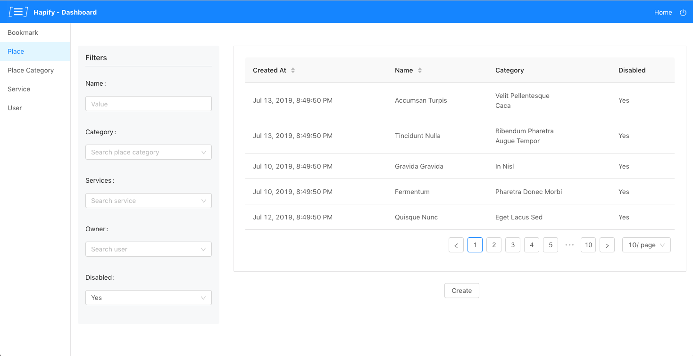
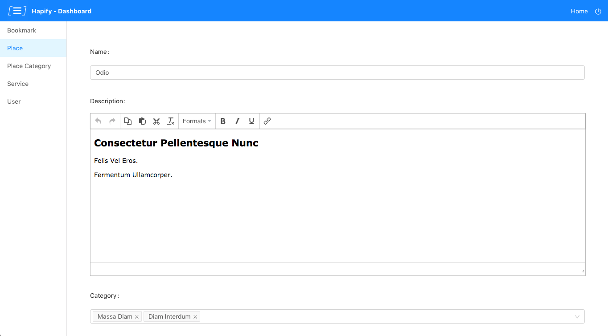

# Angular Dashboard Boilerplate

This boilerplate provides an admin dashboard built with Angular 7.

> This boilerplate is meant to be used with Hapify. To get more info about Hapify setup, please refer to https://www.hapify.io/get-started.

## Preview

Some examples of what you will get:

### Filterable and sortable lists for each model



### Forms for each model



## Get Started

### 1. Clone repository

-   **Option 1**: Clone and configure this boilerplate using command `hpf new --boilerplate ngx_dashboard_tractr`.
-   **Option 2**: You can clone this repository and change the project id in file `hapify.json` by running command `hpf use`.

### 2. Generate code

Then you need to generate code from your Hapify project using `hpf generate`.

⚠️ **Important**: For development purpose, generated files are ignored in the `.gitignore`. You should edit this file and remove the last lines before committing.

### 3. API Dependency

This project can be used with one of these back-ends:

-   [`hapijs_tractr`](https://github.com/Tractr/boilerplate-hapijs): NodeJS API built with [HapiJS](https://hapi.dev/).
-   [`slim_php_tractr`](https://github.com/Tractr/boilerplate-slim-php): PHP API built with [Slim Framework](http://www.slimframework.com/).

Please install and start an API before running Angular Dashboard.
Don't forget to create an admin user (see documentation). Otherwise, you won't be able to connect to the dashboard.

### 4. Start project

Once the API is started, you can run the project:

```bash
npm install
```

```bash
npm start
```

## Advanced Integration

This boilerplate includes a user sessions management.
